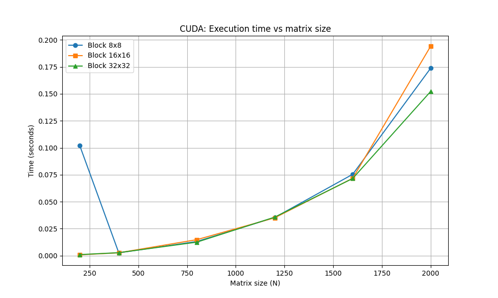
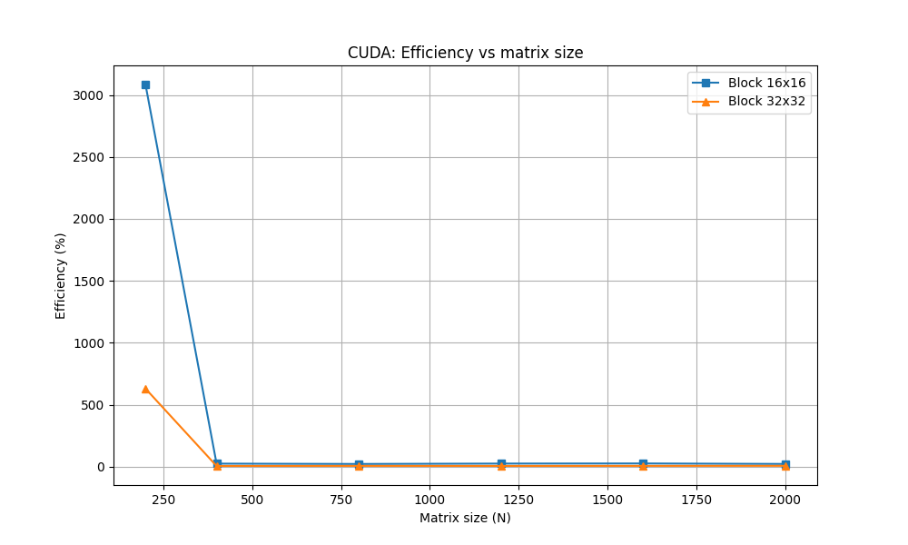

# Лабораторная работа №4 (CUDA)

## Студент
Шуреев К. 6313 3 курс

## Задание
Модифицировать программу из лабораторной работы №1 для параллельной работы с использованием CUDA.

## Результаты

| Размер | Блок | Время (сек) | Ускорение | Эффективность (%) | Статус |
|--------|------|-------------|-----------|-------------------|--------|
| 200 | 8x8 | 0.000794 | 1.00 | 100.0 | PASSED |
| 200 | 16x16 | 0.000794 | 1.00 | 25.0 | PASSED |
| 200 | 32x32 | 0.000961 | 0.83 | 5.2 | PASSED |
| 400 | 8x8 | 0.001466 | 1.00 | 100.0 | PASSED |
| 400 | 16x16 | 0.001424 | 1.03 | 25.8 | PASSED |
| 400 | 32x32 | 0.001333 | 1.10 | 6.9 | PASSED |
| 800 | 8x8 | 0.004342 | 1.00 | 100.0 | PASSED |
| 800 | 16x16 | 0.004580 | 0.95 | 23.8 | PASSED |
| 800 | 32x32 | 0.004552 | 0.95 | 5.9 | PASSED |
| 1200 | 8x8 | 0.010460 | 1.00 | 100.0 | PASSED |
| 1200 | 16x16 | 0.010265 | 1.02 | 25.5 | PASSED |
| 1200 | 32x32 | 0.010214 | 1.02 | 6.4 | PASSED |
| 1600 | 8x8 | 0.021838 | 1.00 | 100.0 | PASSED |
| 1600 | 16x16 | 0.021333 | 1.02 | 25.5 | PASSED |
| 1600 | 32x32 | 0.021115 | 1.03 | 6.4 | PASSED |
| 2000 | 8x8 | 0.037674 | 1.00 | 100.0 | PASSED |
| 2000 | 16x16 | 0.038095 | 0.99 | 24.8 | PASSED |
| 2000 | 32x32 | 0.038108 | 0.99 | 6.2 | PASSED |

## Графики

## Вывод

Размер блока (8×8, 16×16, 32×32) практически не влияет на производительность. Для матрицы 2000×2000 достигнуто время 0.038 секунды. Все тесты пройдены успешно.
