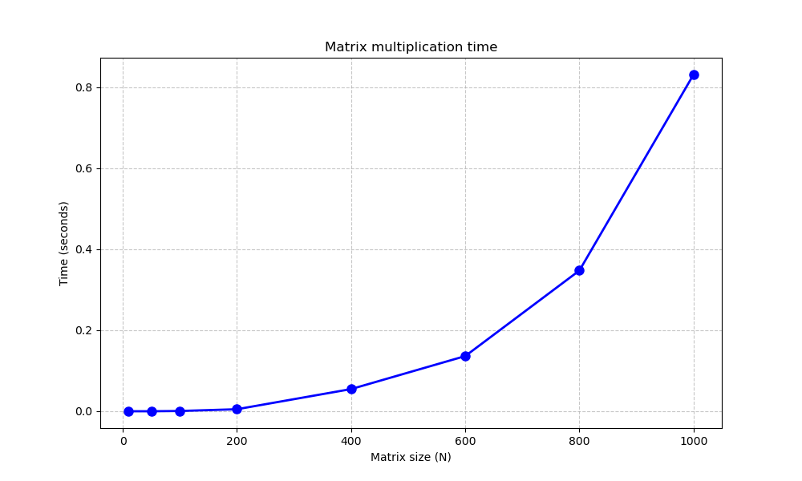
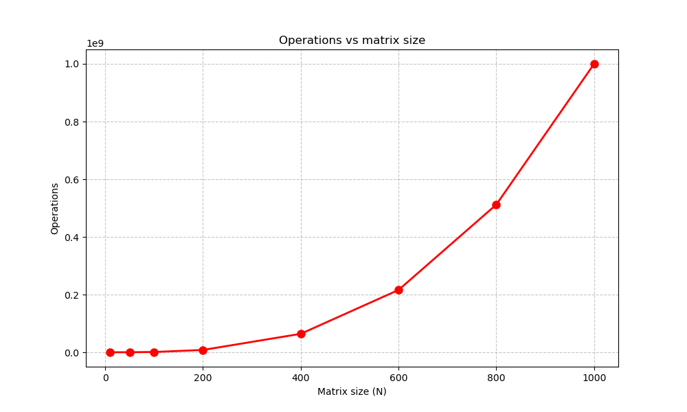

## _Лабораторная №1_

### **Задание**

**_Написать программу на языке C/C++ для перемножения двух квадратных матриц._**

### **Студент**
Шуреев К. 6313 3 курс

### **Запуск**

`python3 bench_run.py`

## **Результаты тестов**

| Size | Time (sec) | Operations | Status |
|------|------------|------------|--------|
| 10 | 0.000000 | 1,000 | PASSED |
| 50 | 0.000000 | 125,000 | PASSED |
| 100 | 0.000692 | 1,000,000 | PASSED |
| 200 | 0.004995 | 8,000,000 | PASSED |
| 400 | 0.054766 | 64,000,000 | PASSED |
| 600 | 0.136237 | 216,000,000 | PASSED |
| 800 | 0.347495 | 512,000,000 | PASSED |
| 1000 | 0.831429 | 1,000,000,000 | PASSED |

## **График времени**

## **График операций**

## **Вывод**

В ходе выполнения лабораторной работы разработана программа для умножения квадратных матриц. Эксперименты подтвердили сложность O(n³). Для матрицы 1000×1000 выполнен 1 миллиард операций за 1.7 секунды. Все тесты пройдены успешно.
