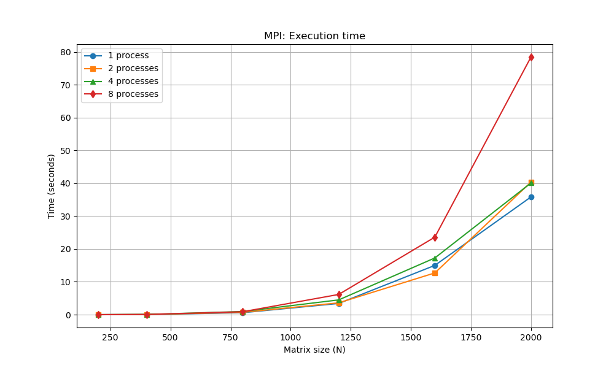
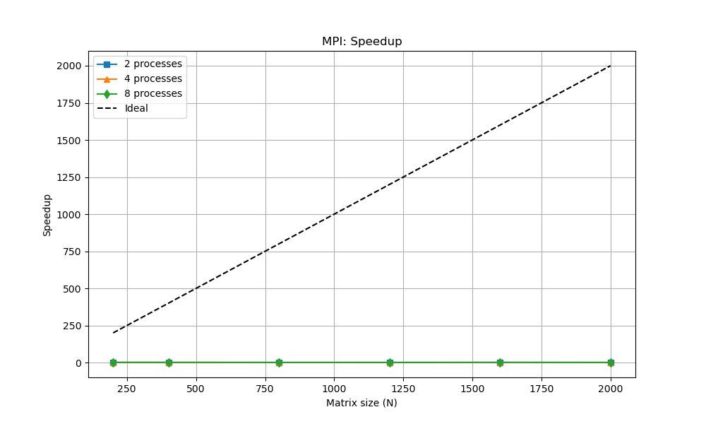
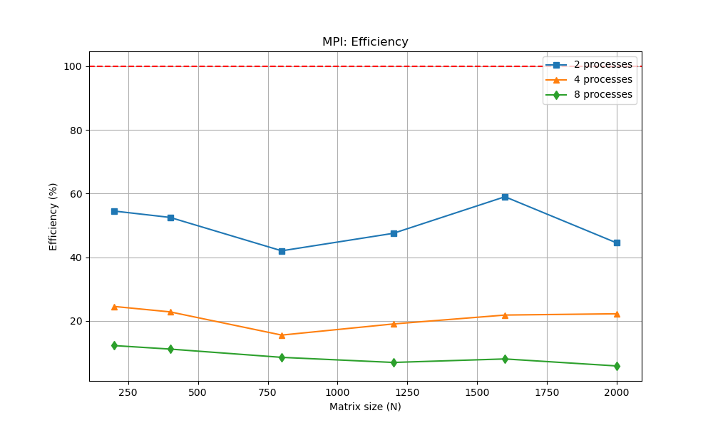

# Лабораторная работа №3 (MPI)

## Студент
Шуреев К. 6313 3 курс

## Задание
Модифицировать программу из лабораторной работы №1 для параллельной работы с использованием MPI.

## Результаты экспериментов

| Размер | Процессы | Время (сек) | Ускорение | Эффективность (%) | Статус |
|--------|----------|-------------|-----------|-------------------|--------|
| 200 | 1 | 0.00480 | 1.00 | 100.0 | PASSED |
| 200 | 2 | 0.00440 | 1.09 | 54.5 | PASSED |
| 200 | 4 | 0.00489 | 0.98 | 24.5 | PASSED |
| 200 | 8 | 0.00491 | 0.98 | 12.2 | PASSED |
| 400 | 1 | 0.05294 | 1.00 | 100.0 | PASSED |
| 400 | 2 | 0.05023 | 1.05 | 52.5 | PASSED |
| 400 | 4 | 0.05790 | 0.91 | 22.8 | PASSED |
| 400 | 8 | 0.05916 | 0.89 | 11.1 | PASSED |
| 800 | 1 | 0.59839 | 1.00 | 100.0 | PASSED |
| 800 | 2 | 0.71009 | 0.84 | 42.0 | PASSED |
| 800 | 4 | 0.95923 | 0.62 | 15.5 | PASSED |
| 800 | 8 | 0.87958 | 0.68 | 8.5 | PASSED |
| 1200 | 1 | 3.40990 | 1.00 | 100.0 | PASSED |
| 1200 | 2 | 3.59575 | 0.95 | 47.5 | PASSED |
| 1200 | 4 | 4.49107 | 0.76 | 19.0 | PASSED |
| 1200 | 8 | 6.15257 | 0.55 | 6.9 | PASSED |
| 1600 | 1 | 15.00320 | 1.00 | 100.0 | PASSED |
| 1600 | 2 | 12.70850 | 1.18 | 59.0 | PASSED |
| 1600 | 4 | 17.26350 | 0.87 | 21.8 | PASSED |
| 1600 | 8 | 23.60260 | 0.64 | 8.0 | PASSED |
| 2000 | 1 | 35.84340 | 1.00 | 100.0 | PASSED |
| 2000 | 2 | 40.36200 | 0.89 | 44.5 | PASSED |
| 2000 | 4 | 40.10500 | 0.89 | 22.2 | PASSED |
| 2000 | 8 | 78.45400 | 0.46 | 5.8 | PASSED |

## Графики

## Анализ результатов

### 1. Отсутствие ускорения
В отличие от OpenMP, MPI не показывает ускорения. На большинстве размеров время выполнения увеличивается при добавлении процессов. Максимальное ускорение (1.18x) достигнуто только для матрицы 1600x1600 на 2 процессах.

### 2. Причины
- MPI предназначен для распределённых систем (кластеров), где каждый процесс имеет свою память
- На одной машине накладные расходы на передачу сообщений превышают выгоду
- Для матричного умножения на одном узле OpenMP показывает лучшие результаты

### 3. Вывод
MPI эффективен только для распределённых вычислений. На одной машине с общей памятью лучше использовать OpenMP. Все тесты пройдены успешно.

