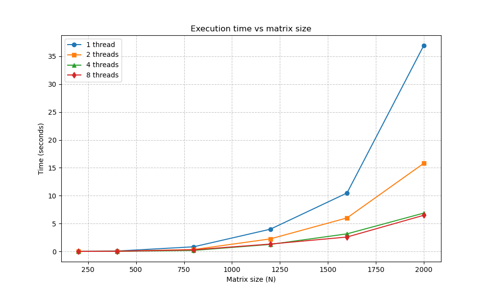
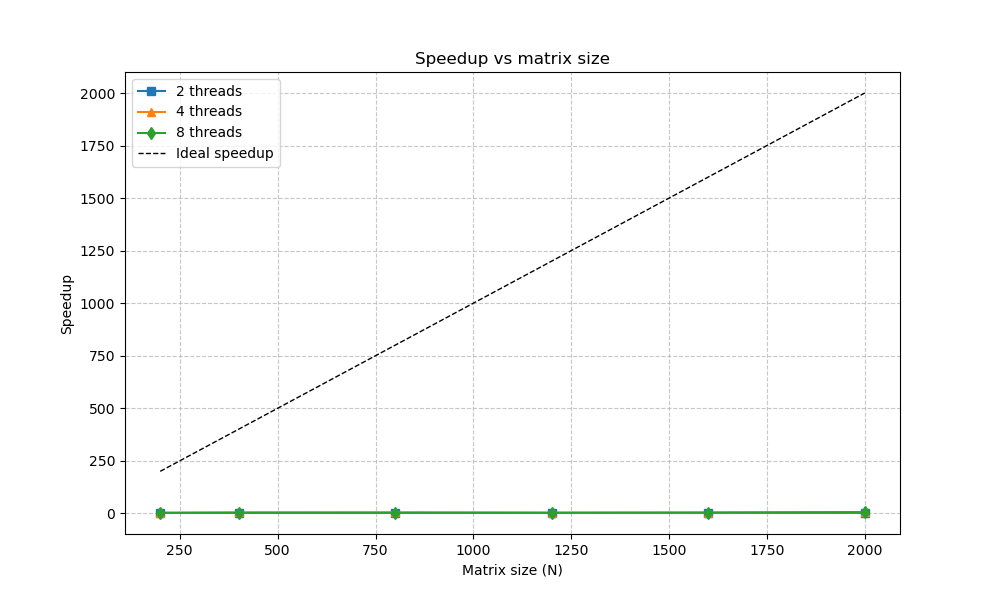
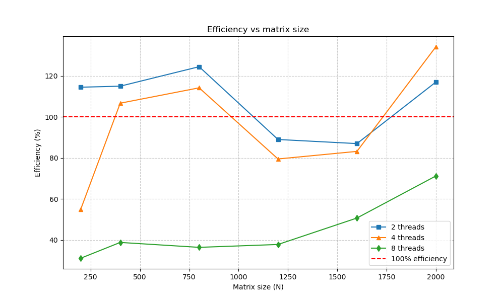

# Лабораторная работа №2 (OpenMP)

## Студент
Шуреев К. 6313 3 курс

## Задание
Модифицировать программу из лабораторной работы №1 для параллельной работы с использованием OpenMP. Провести эксперименты с разным количеством потоков (1, 2, 4, 8) и разными размерами матриц (200, 400, 800, 1200, 1600, 2000).

## Результаты экспериментов

| Размер | Потоки | Время (сек) | Ускорение | Эффективность (%) | Статус |
|--------|--------|-------------|-----------|-------------------|--------|
| 200 | 1 | 0.00702 | 1.00 | 100.0 | PASSED |
| 200 | 2 | 0.00306 | 2.29 | 114.5 | PASSED |
| 200 | 4 | 0.00319 | 2.20 | 55.0 | PASSED |
| 200 | 8 | 0.00281 | 2.49 | 31.1 | PASSED |
| 400 | 1 | 0.06069 | 1.00 | 100.0 | PASSED |
| 400 | 2 | 0.02638 | 2.30 | 115.0 | PASSED |
| 400 | 4 | 0.01420 | 4.27 | 106.7 | PASSED |
| 400 | 8 | 0.01958 | 3.10 | 38.8 | PASSED |
| 800 | 1 | 0.82035 | 1.00 | 100.0 | PASSED |
| 800 | 2 | 0.32891 | 2.49 | 124.5 | PASSED |
| 800 | 4 | 0.17954 | 4.57 | 114.2 | PASSED |
| 800 | 8 | 0.28187 | 2.91 | 36.4 | PASSED |
| 1200 | 1 | 3.97919 | 1.00 | 100.0 | PASSED |
| 1200 | 2 | 2.24121 | 1.78 | 89.0 | PASSED |
| 1200 | 4 | 1.25050 | 3.18 | 79.5 | PASSED |
| 1200 | 8 | 1.31593 | 3.02 | 37.8 | PASSED |
| 1600 | 1 | 10.47750 | 1.00 | 100.0 | PASSED |
| 1600 | 2 | 6.00477 | 1.74 | 87.0 | PASSED |
| 1600 | 4 | 3.14728 | 3.33 | 83.2 | PASSED |
| 1600 | 8 | 2.57750 | 4.06 | 50.7 | PASSED |
| 2000 | 1 | 36.92590 | 1.00 | 100.0 | PASSED |
| 2000 | 2 | 15.79380 | 2.34 | 117.0 | PASSED |
| 2000 | 4 | 6.87083 | 5.37 | 134.2 | PASSED |
| 2000 | 8 | 6.47807 | 5.70 | 71.2 | PASSED |

## Графики

### Время выполнения от размера матрицы

### Ускорение

### Эффективность

## Анализ результатов

### 1. Общая масштабируемость
При увеличении количества потоков наблюдается ускорение вычислений. Максимальное ускорение достигнуто на матрице 2000×2000 с 4 потоками - 5.37 раза. При 8 потоках ускорение составляет 5.7 раза.

### 2. Сверхлинейное ускорение
Для размеров 200, 400, 800 и 2000 наблюдается сверхлинейное ускорение (эффективность >100%):
- N=200, 2 потока: эффективность 114.5%
- N=400, 4 потока: эффективность 106.7%
- N=800, 2 и 4 потока: эффективность 124.5% и 114.2%
- N=2000, 2 и 4 потока: эффективность 117.0% и 134.2%

Это объясняется тем, что при последовательном выполнении данные не полностью помещаются в кэш-память, а при параллельном - данные распределяются между кэшами разных ядер, уменьшая задержки доступа к памяти.

### 3. Падение эффективности на 8 потоках
На 8 потоках эффективность значительно снижается (от 31% до 71%). Причины:
- Накладные расходы на создание и синхронизацию потоков
- Ограниченность пропускной способности памяти
- Конкуренция за доступ к общей памяти

### 4. Оптимальная конфигурация
Для данного процессора оптимальным является использование 4 потоков, особенно на больших матрицах (N≥1200). Для матрицы 2000×2000 время выполнения на 4 потоках составляет 6.87 секунды против 36.9 секунды на 1 потоке.

## Вывод

В ходе выполнения лабораторной работы программа умножения матриц была модифицирована с использованием OpenMP. Эксперименты показали:
- Параллельная версия работает корректно (все тесты PASSED)
- Достигнуто ускорение до 5.7 раза на 8 потоках
- Наблюдается сверхлинейное ускорение для некоторых конфигураций
- Оптимальное количество потоков для данной системы - 4
